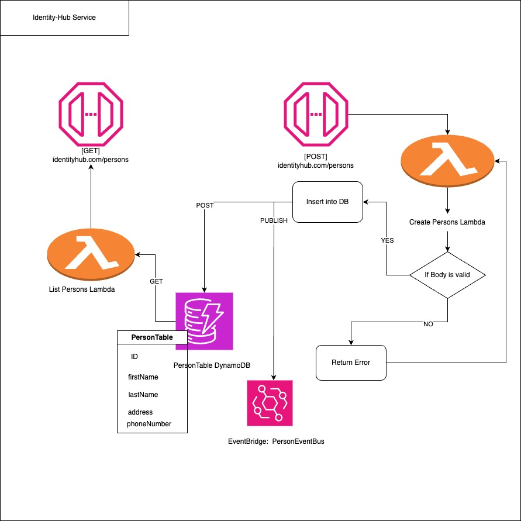

# Identity-Hub

Identity-Hub is a serverless application built with GoLang and TypeScript using [Serverless Stack](https://sst.dev) (SST). The service exposes endpoints to manage Person Information.

## Project structure

## Folder Structure

The following directories are the most important ones in the project:

- `packages/lambda`: Contains the Lambda function that is triggered by API Gateway.
- `packages/dynamodb`: Contains DB functions.
- `packages/formats`: Contains the data types and functions for validation.
- `stacks`: Contains the CDK stacks that define the infrastructure of the application.

## Setup

In order to run the project, you can run:
- Install the dependecies with: `npm install`
- Setup AWS credentials with: `aws sso login`